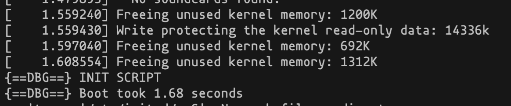
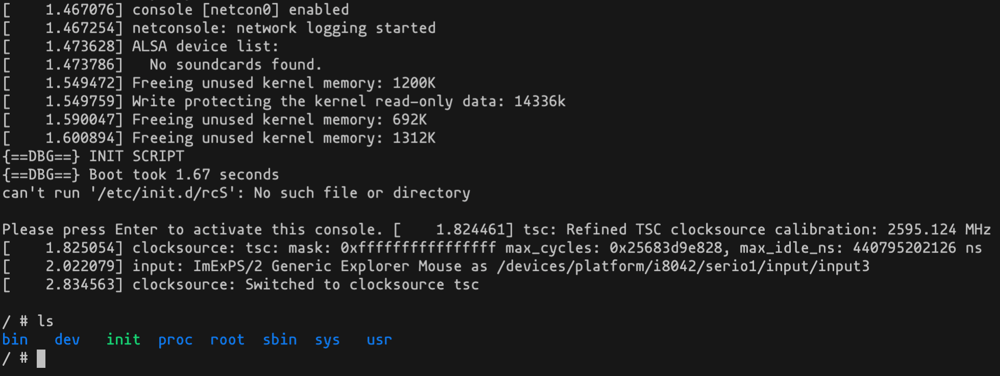
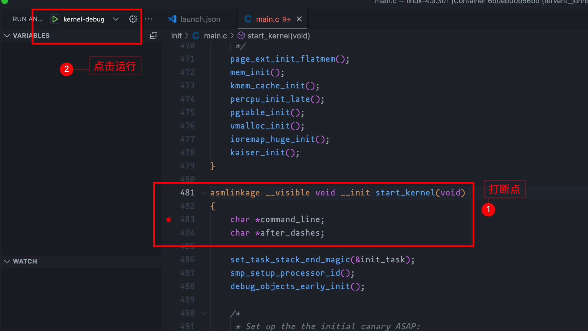
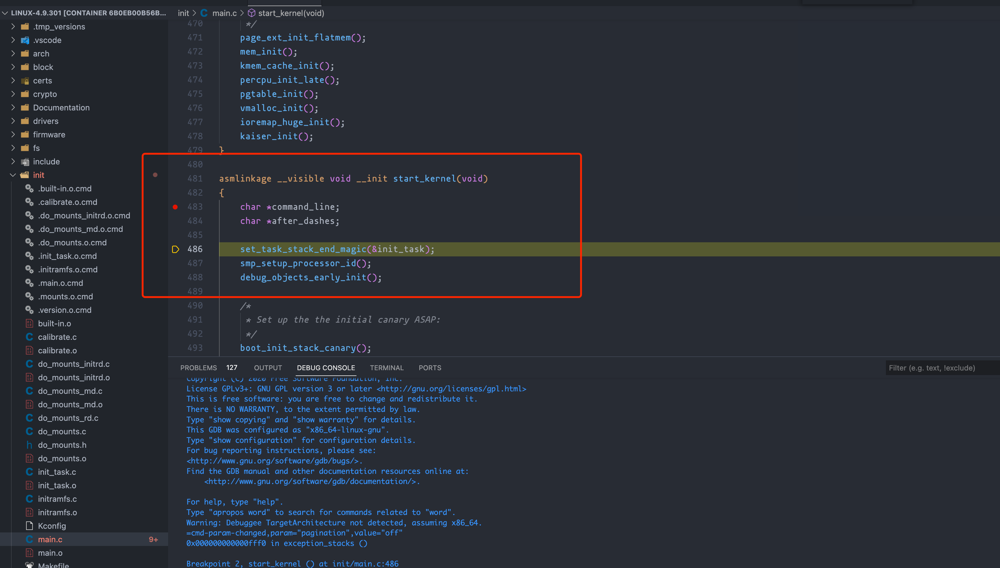

# qemu-linux

## 使用

运行容器：

```shell
$ git clone https://github.com/pedrogao/qemu-linux
$ cd qemu-linux && docker build . -t qemu-linux
$ docker run -it qemu-linux /bin/bash
```
进入容器后，运行脚本启动 qemu：
```shell
# ./run.sh
```
运行结果：



## 环境搭建

依赖：

* Docker
通过 docker 搭建 ubuntu20.04 环境，Dockerfile 如下：

```dockerfile
FROM ubuntu:20.04

ENV DEBIAN_FRONTEND=noninteractive

RUN echo "deb http://mirrors.aliyun.com/ubuntu/ focal main restricted universe multiverse \n \
deb-src http://mirrors.aliyun.com/ubuntu/ focal main restricted universe multiverse \n \
deb http://mirrors.aliyun.com/ubuntu/ focal-security main restricted universe multiverse \n \
deb-src http://mirrors.aliyun.com/ubuntu/ focal-security main restricted universe multiverse \n \
deb http://mirrors.aliyun.com/ubuntu/ focal-updates main restricted universe multiverse \n \
deb-src http://mirrors.aliyun.com/ubuntu/ focal-updates main restricted universe multiverse \n \
deb http://mirrors.aliyun.com/ubuntu/ focal-proposed main restricted universe multiverse \n  \
deb-src http://mirrors.aliyun.com/ubuntu/ focal-proposed main restricted universe multiverse \n \
deb http://mirrors.aliyun.com/ubuntu/ focal-backports main restricted universe multiverse \n \
deb-src http://mirrors.aliyun.com/ubuntu/ focal-backports main restricted universe multiverse">/etc/apt/sources.list

RUN cat /etc/apt/sources.list
RUN apt update 
RUN apt-get install -y wget \
    gcc \
    gcc-multilib \
    git \
    make \
    bc \
    texinfo \
    gdb \
    cgdb \
    qemu-system-x86-64 \
    libncurses5-dev \
    vim \
    cpio
```
然后将其编译为一个本地镜像：
```shell
docker build -t qemu-20 .
```
这样就有一个装有 qemu 的 ubuntu20.04 的镜像环境了：
```shell
docker run -it qemu-20 /bin/bash
```
进入容器后，编译 Linux 源码：
```shell
$ cd home/
$ wget http://ftp.sjtu.edu.cn/sites/ftp.kernel.org/pub/linux/kernel/v4.x/linux-4.9.301.tar.gz
$ tar -xzf ./linux-4.9.301.tar.gz

$ make menuconfig
```
开启 debug 信息，路径如下：
```plain
Kernel hacking --->
  Compile-time checks and compiler options --->
    [ ] Compile the kernel with debug info
```
 按空格选中，其它默认。生成 .config 配置文件后，开始编译内核：
```shell
make -j8
```
查询内核镜像：
```shell
# ls ./arch/x86_64/boot/        
bzImage
```

下载 busybox：

```shell
# cd ..
# wget https://busybox.net/downloads/busybox-1.32.1.tar.bz2
# tar -xf busybox-1.32.1.tar.bz2
# cd busybox-1.32.1
```
编译 busybox：
```shell
# make menuconfig
```
选择 settings -> build options -> build static binary，保存并退出，然后编译：
```shell
# make -j8 && make install
# ls ./_install/

bin  linuxrc  sbin  usr
```
构建 initramfs 根文件系统：
```shell
# cd .. 
# mkdir initramfs
# cd initramfs/

# cp -rf ../busybox-1.32.1/_install/* ./ 
# mkdir dev proc sys
# ln -sf /dev/null /dev/tty1
# ln -sf /dev/null /dev/tty2
# ln -sf /dev/null /dev/tty3
# ln -sf /dev/null /dev/tty4
# cp -a /dev/{null,console,tty,tty1,tty2,tty3,tty4} dev/
# rm -f linuxrc
```
新建 init 文件，并添加如下内容：
```shell
#!/bin/busybox sh
echo "{==DBG==} INIT SCRIPT"
mount -t proc none /proc
mount -t sysfs none /sys
echo -e "{==DBG==} Boot took $(cut -d' ' -f1 /proc/uptime) seconds"
exec /sbin/init
```
如下：
```shell
# chmod a+x init

# ls
bin  dev  init  proc  sbin  sys  usr 
```
打包 initramfs：
```shell
# find . -print0 | cpio --null -ov --format=newc | gzip -9 > ../initramfs.cpio.gz
# cd ..
# ls | grep 'initramfs'
initramfs
initramfs.cpio.gz
```

运行内核：

```shell
# qemu-system-x86_64 -kernel ./linux-4.9.301/arch/x86/boot/bzImage -initrd ./initramfs.cpio.gz -append "nokaslr console=ttyS0" -nographic
```
或者：
```shell
# qemu-system-x86_64 -nographic -kernel ./linux-4.9.301/arch/x86/boot/bzImage -initrd ./initramfs.cpio.gz -append "noapic console=ttyS0 norandmaps"
```
运行成功截图：



或者调试内核，监听在 1234 端口：

```shell
# qemu-system-x86_64 -kernel ./linux-4.9.301/arch/x86/boot/bzImage -initrd ./initramfs.cpio.gz -append "nokaslr console=ttyS0" -s -S -nographic
```
通过 vscode attch 至容器，然后在容器中安装 cpp 插件，在 init/main.c 中打上断点，调试配置如下：
```json
{
    // Use IntelliSense to learn about possible attributes.
    // Hover to view descriptions of existing attributes.
    // For more information, visit: https://go.microsoft.com/fwlink/?linkid=830387
    "version": "0.2.0",
    "configurations": [
        {
            "name": "kernel-debug",
            "type": "cppdbg",
            "request": "launch",
            "miDebuggerServerAddress": "127.0.0.1:1234",
            "program": "${workspaceFolder}/vmlinux",
            "args": [],
            "stopAtEntry": false,
            "cwd": "${workspaceFolder}",
            "environment": [],
            "externalConsole": false,
            "logging": {
                "engineLogging": false
            },
            "MIMode": "gdb",
        }
    ]
}
```
如下图：



然后开始愉快的调试 Linux 内核：



## 参考资料

* [https://juejin.cn/post/6856591451418329101](https://juejin.cn/post/6856591451418329101)
* [https://bbs.huaweicloud.com/blogs/348654](https://bbs.huaweicloud.com/blogs/348654)
* [https://zhuanlan.zhihu.com/p/109442115](https://zhuanlan.zhihu.com/p/109442115)
* ubuntu 20.04 更换阿里源 [https://www.jianshu.com/p/ec76a50bef0b](https://www.jianshu.com/p/ec76a50bef0b)
* 解决构建 docker 镜像时交互问题 [https://blog.csdn.net/jiangjiang_jian/article/details/100731400](https://blog.csdn.net/jiangjiang_jian/article/details/100731400)
* rootfs 文件构建 [http://www.wowotech.net/x_project/simple_busybox.html](http://www.wowotech.net/x_project/simple_busybox.html)
